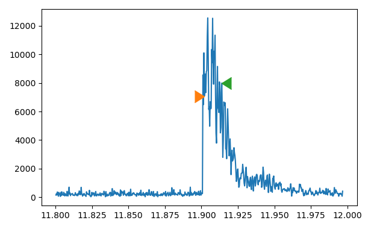

# motorSync

This repository contains klipper Macros and python scripts to do motor synchronization for AWD 3D printers. It has been applied and verified on a VZbot.

WARNING: Please apply the script standalone first. Check the output. If everything makes sense, incorporate it in your flow.

## Prerequisite

Install https://github.com/droans/klipper_extras. The synchronization procedure makes use of python scripts from within klipper Macros.
At the moment, there is a small bug within the klipper_extras installer. If prompted to update your printer_data/config/moonraker.conf for updating the
repository, prompt with no to complete. Add the update section to your printer_data/config/moonraker.conf manually.

## Installation

The folder structure of the repository represents the home directory. Copy the provided files accordingly OR create symbolic links. Using links has the advantage that updates of the repository will automatically apply when pulling the changes from GitHub.

Clone the repository in your home directory.
```
cd
git clone https://github.com/DupiDachs/motorSync.git
```
These are the files that evaluate motor synchronization and ADXL noise.
```
cd
mkdir klipper_functions
cd klipper_functions
ln -s ../motorSync/klipper_functions/motorSync_accel.py motorSync_accel.py
ln -s ../motorSync/klipper_functions/motorSync_noise.py  motorSync_noise.py
```
Symbolic link for the yaml file for letting klipper know where to find the python files.
```
cd
mkdir printer_data/functions
cd printer_data/functions
ln -s ../../motorSync/printer_data/functions/config.yaml config.yaml
```
Symbolic link to the config file containing the motorSync Macros.
```
cd
cd printer_data/config
ln -s ../../motorSync/printer_data/config/MotorSync.cfg MotorSync.cfg
```
Take a look at `motorSync/printer_data/config/printer.cfg` and add the changes to your `printer.cfg` file.

### Changes to printer_data/config/motorSync.cfg
- adapt the `ACCELEROMETER_MEASURE` calls if your chip is not named `adxl345`
- no other changes required anymore with newest version
 
## Usage

The synchronization macro is executed with `MOTSYNC_SYNC`. Call this before starting a print. There is no need to PAUSE or RESUME your print.

## Some background

The Macro does not use any delayed gcode. This is achieved by having a constant number of vibration runs required to obtain the best synchronization at the expense of a somewhat larger runtime.

The Macro determines static noise of your accelerometer (and gravity) and removes it from the measurement, which makes the approach more reliable.

To bring down the quality of the synchronization to a single number, the peak vibration is determined and then the area of the chart is determined within an (arbitrary) 20ms timespan. The data that was cleaned from noise looks like this:


Now the magnitude is calculated and the area between the two markers is calculated via integration, representing the quality of the synchronization.



## Kudos
Kudos goes to Altzbox with his initial script: https://github.com/altzbox/motors_sync/wiki/Motor-synchronization-on-printers-with-QuadXY-kinematics-(AWD)
I tried to improve on some of the limitations.

Differences between the two scripts
|                   | motors_sync                                                                           | motorSync                                                 |
|-------------------|---------------------------------------------------------------------------------------|-----------------------------------------------------------|
| master            | python script invoced via system call. uses klippy.serial to invoke klipper movements | klipper Macro. uses klipper_extras to call python scripts |
| timing            | hard coded manually                                                                   | klipper times Macro automatically                         |
| PAUSE&RESUME macro| needed to synchronize Python and Klipper                                              | Not needed. Klipper is master of the timing               |
| motor sync factor | determined by highest peaks of magnitude and moving average                           | integrate to determine area of magnitude                  |

motors_sync has a big potential of speedup using the BUZZ Macro of motorSync. In the end, motorSync is faster, but more iterations are performed. Getting a result accurate to a 1/32 fullstep requires 46sec + homing.

## Example output
```
22:23:29; $ MOTSYNC_SYNC
22:23:29; echo: MOTSYNC: Starting AWD motor synchronization for
22:23:29; echo: MOTSYNC: microstepping of 32 and a fullstep distance of 0.1 mm.
22:23:29; echo: MOTSYNC: Home and move to center.
22:23:42; echo: MOTSYNC: Measure noise.
22:23:44; echo: MOTSYNC: Determined noise as (x,y,z) (313.37407302049183, 377.71019840573774, 9218.900971946721).
22:23:44; echo: MOTSYNC: Optimize for best X position.
22:23:44; echo: MOTSYNC: Evaluate synchronization at microstep position -16.0
22:23:46; echo: MOTSYNC: Synchronization factor is 131.10201682386037.
22:23:46; echo: MOTSYNC: Evaluate synchronization at microstep position -8.0
22:23:48; echo: MOTSYNC: Synchronization factor is 122.75476548584527.
22:23:48; echo: MOTSYNC: Evaluate synchronization at microstep position 0.0
22:23:50; echo: MOTSYNC: Synchronization factor is 10.144989450044031.
22:23:50; echo: MOTSYNC: Evaluate synchronization at microstep position 8.0
22:23:52; echo: MOTSYNC: Synchronization factor is 2.9955519500327896.
22:23:52; echo: MOTSYNC: Evaluate synchronization at microstep position 16.0
22:23:54; echo: MOTSYNC: Synchronization factor is 15.33262148629301.
22:23:54; echo: MOTSYNC: Evaluate synchronization at microstep position 12.0
22:23:56; echo: MOTSYNC: Synchronization factor is 3.403840422775477.
22:23:56; echo: MOTSYNC: Evaluate synchronization at microstep position 4.0
22:23:58; echo: MOTSYNC: Synchronization factor is 2.5624780210309894.
22:23:58; echo: MOTSYNC: Evaluate synchronization at microstep position 10.0
22:24:00; echo: MOTSYNC: Synchronization factor is 3.307435555259079.
22:24:00; echo: MOTSYNC: Evaluate synchronization at microstep position 6.0
22:24:02; echo: MOTSYNC: Synchronization factor is 2.829363542729999.
22:24:02; echo: MOTSYNC: Evaluate synchronization at microstep position 9.0
22:24:04; echo: MOTSYNC: Synchronization factor is 2.585406277696018.
22:24:04; echo: MOTSYNC: Evaluate synchronization at microstep position 7.0
22:24:06; echo: MOTSYNC: Synchronization factor is 2.6128725245745064.
22:24:06; echo: MOTSYNC: Final x synchronization factor is 2.5624780210309894
22:24:06; echo: MOTSYNC: Final position is 4 microstep(s)
22:24:06; echo: MOTSYNC: Optimize for best Y position.
22:24:06; echo: MOTSYNC: Evaluate synchronization at microstep position -16.0
22:24:08; echo: MOTSYNC: Synchronization factor is 2.1976272697568.
22:24:08; echo: MOTSYNC: Evaluate synchronization at microstep position -8.0
22:24:10; echo: MOTSYNC: Synchronization factor is 18.33726938847482.
22:24:10; echo: MOTSYNC: Evaluate synchronization at microstep position 0.0
22:24:12; echo: MOTSYNC: Synchronization factor is 28.6595991124009.
22:24:12; echo: MOTSYNC: Evaluate synchronization at microstep position 8.0
22:24:14; echo: MOTSYNC: Synchronization factor is 46.8069367532272.
22:24:14; echo: MOTSYNC: Evaluate synchronization at microstep position 16.0
22:24:16; echo: MOTSYNC: Synchronization factor is 62.87347487455113.
22:24:16; echo: MOTSYNC: Evaluate synchronization at microstep position -12.0
22:24:18; echo: MOTSYNC: Synchronization factor is 8.183742076236035.
22:24:18; echo: MOTSYNC: Evaluate synchronization at microstep position -20.0
22:24:20; echo: MOTSYNC: Synchronization factor is 2.7796217335183773.
22:24:20; echo: MOTSYNC: Evaluate synchronization at microstep position -14.0
22:24:22; echo: MOTSYNC: Synchronization factor is 3.207420021822505.
22:24:22; echo: MOTSYNC: Evaluate synchronization at microstep position -18.0
22:24:24; echo: MOTSYNC: Synchronization factor is 8.369112710219913.
22:24:24; echo: MOTSYNC: Evaluate synchronization at microstep position -15.0
22:24:26; echo: MOTSYNC: Synchronization factor is 15.572115661919586.
22:24:26; echo: MOTSYNC: Evaluate synchronization at microstep position -17.0
22:24:28; echo: MOTSYNC: Synchronization factor is 13.91230988006706.
22:24:28; echo: MOTSYNC: Final y synchronization factor is 2.1976272697568
22:24:28; echo: MOTSYNC: Final position is -16 microstep(s)
22:24:28; echo: MOTSYNC: Done!
```
