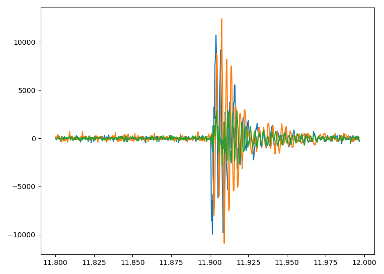

# motorSync

This repository contains scripts to do motor synchronization for AWD 3D printers. It has been prepared to be used on the VZbot

## Prerequisite

Install https://github.com/droans/klipper_extras. The synchronization procedure makes use of python scripts from within klipper Macros.
At the moment, there is a small bug within the klipper_extras installer. If prompted to update your printer_data/config/moonraker.conf for updating the
repository, prompt with no to complete. Add the update section to your printer_data/config/moonraker.conf manually.

## Installation

The folder structure of the repository represents the home directory. Copy the provided files accordingly.

Copy the python files that evaluate motor synchronization and ADXL noise.
```
cd
mkdir klipper_functions/
cp motorSync/klipper_functions/* klipper_functions/
```
Copy the yaml file for letting klipper know where to find the python files.
```
cd
mkdir printer_data/functions
cp motorSync/printer_data/functions/* printer_data/functions/
```
Copy the config file containing the motorSync Macros.
```
cd
cp motorSync/printer_data/config/motorSync.cfg printer_data/config/
```
Take a look at `motorSync/printer_data/config/printer.cfg` and add the changes to your `printer.cfg` file.

### Changes to printer_data/config/motorSync.cfg
- adapt the `ACCELEROMETER_MEASURE` calls if your chip is not named `adxl345`
- on top of the file
  - adjust the number of microsteps you are using
  - adjust the distance of a fullstep of your printer
  - adjust the number of optimization runs, depending on the accuracy you wish
 
## Usage

The synchronization macro is executed with `MOTSYNC_SYNC`. Call this before starting a print. There is no need to PAUSE or RESUME your print.

## Some background

The Macro does not use any delayed gcode. This is achieved by having a constant number of vibration runs required to obtain the best synchronization at the expense of a somewhat larger runtime.

The Macro determines static noise of your accelerometer (and gravity) and removes it from the measurement, which makes the approach more reliable.

To determine the quality of the synchronization to a single number, the peak vibration is determined and then the area of the chart is determined within an (arbitrary) 12ms timespan. The data that was cleaned from noise looks like this:



Now the magnitude is calculated and the area between the two markers is calculated, representing the quality of the synchronization.


## Kudos
Kudos goes to Altzbox with his initial script: https://github.com/altzbox/motors_sync/wiki/Motor-synchronization-on-printers-with-QuadXY-kinematics-(AWD)
I tried to improve on some of the limitations.
